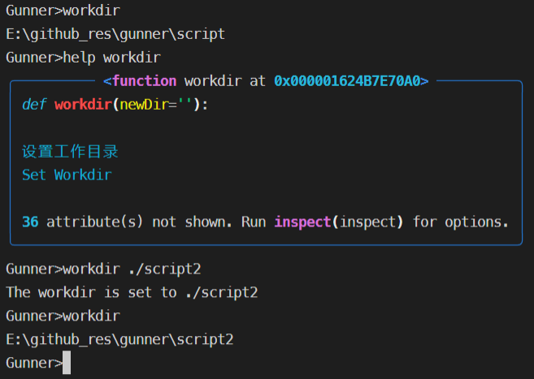
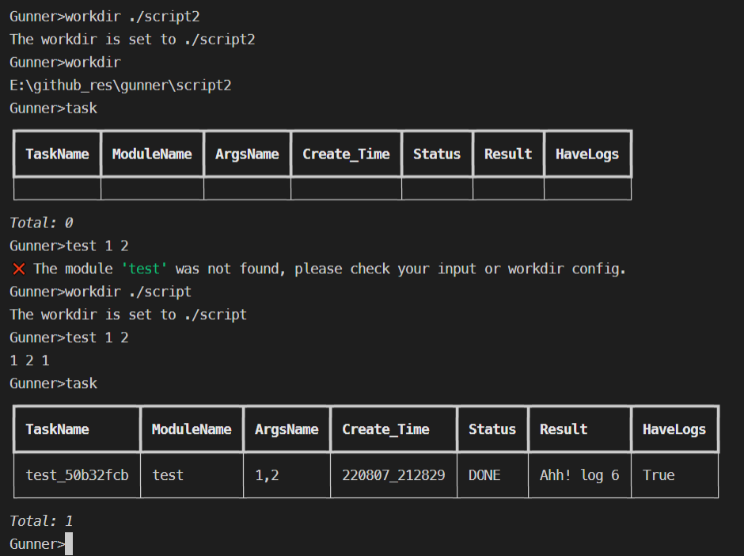
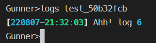
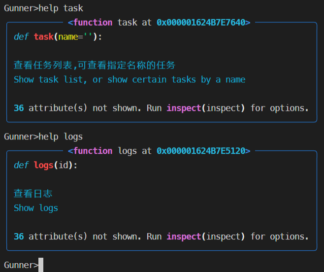

```
   ______                           
  / ____/_  ______  ____  ___  _____
 / / __/ / / / __ \/ __ \/ _ \/ ___/ = Enjoy Being a Hacker =
/ /_/ / /_/ / / / / / / /  __/ /    
\____/\__,_/_/ /_/_/ /_/\___/_/     


Gunner是一个Python用户自定义脚本管理器
Gunner is a user-defined script manager in python

对你自己的脚本做一些简单修改
You may make slight changes in your own scripts,

即可在支持后台并行任务的Gunner CLI中运行
and run them in Gunner's CLI, which supports background and concurrent tasks.
```

# 安装/Install

    git clone https://github.com/GeekBar-Boss/Gunner.git

# 基础使用/Basic Usage

目前Gunner有如下四个内置模块

Currently Gunner has following builtin modules

- workdir
  
  支持相对路径
  
  Supporting relative path.
  
  

- task
  
      task [ModuleName]
  
  

- logs
  
      logs <TaskName>
  
  

- help
  
  

The script should be like this:

```python
import time
#就写这么一句引入GunnerMod的语句就行
#Just import GunnerMod decorator in lib.Interface.
#Don't have to think of the script's position as long as you appoint the workdir
from lib.Interface import GunnerMod
#这个标记表示着这个脚本是否是一个非同步任务
#This flag means if this script is run as a non-synchronous task
CONCURRENT_FLAG_OF_GUNNER = False
#只需要在start函数上添加GunnerMod装饰器,这个函数必须叫"start"
#Simply add a GunnerMod decorator on start function,
#which is a entry function of your script and must be named "start"
@GunnerMod
def start(a,b,c=1,taskinfo=None):
    #输入 "test 1 2"
    #When you run "test 1 2".
    #控制台就会显示 1 2 1, 但我不推荐直接打印内容
    #CLI would show 1 2 1, though I don't recommend printing directly.
    print(a,b,c)
    time.sleep(3)
    
    #Taskinfo 是一个有用的与控制台交互的接口
    #Taskinfo is a useful interface to interact with CLI.
    
    #三秒之后运行"task"
    #After 3 seconds, run "task".
    taskinfo.update("Now new status.")
    #Then you'll see the text updated in status column.

    #你可以用log来记录脚本运行时的日志, 每满五条就会写入日志文件
    #Log down something happening in running script, log will be written to log file every 5 items.
    taskinfo.log("log 1")
    taskinfo.log("as you can see,log 2")
    taskinfo.log("Oh,log 3")
    taskinfo.log("My god, log 4")
    taskinfo.log("Holy shit, log 5")
    taskinfo.log("Ahh! log 6")
```

你可以这样运行一个工作目录下的脚本

You may run a script in workdir like this

```
Gunner>scriptname arg1 arg2 arg3key=arg3 arg4
```

不以key=value形式指定的关键词参数需要注意顺序

You have to input non-keyword arguments in order
